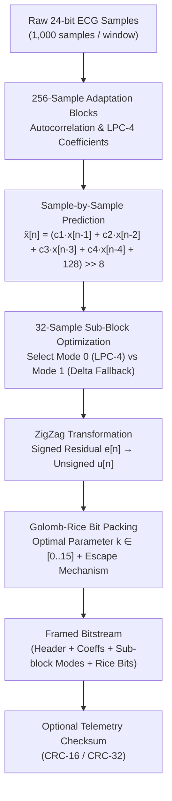
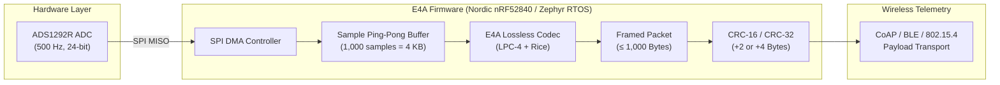

# E4A Lossless ECG Compression — R&D Documentation

[](#exact-lossless-validation)
[-blue)](#experiment-b--500-hz-simulated-ads1292r-stream)
[](#next-step-e4a-firmware-implementation)

This repository contains the R&D reference implementation, empirical evaluation, and engineering audit of the lossless ECG compression algorithm designed for the **E4A wearable medical telemetry device**.

---

## Quick Navigation
- [1. The Problem](#1-the-problem)
- [2. Compression Techniques Tested (R&D Journey)](#2-compression-techniques-tested-rd-journey)
- [3. Final Compression Technique](#3-final-compression-technique)
- [4. Why We Selected This Approach](#4-why-we-selected-this-approach)
- [5. Benchmark Results](#5-benchmark-results)
- [6. Exact Lossless Validation](#6-exact-lossless-validation)
- [7. CRC Overhead Analysis](#7-crc-overhead-analysis)
- [8. System Architecture](#8-system-architecture)
- [9. Next Step: E4A Firmware Implementation](#9-next-step-e4a-firmware-implementation)
- [10. Current Limitations](#10-current-limitations)
- [11. R&D Conclusion](#11-rd-conclusion)

---

## 1. The Problem

The E4A telemetry device monitors real-time cardiac signals using an analog front-end (Texas Instruments **ADS1292R**). Wireless transmission (via BLE, CoAP, or IEEE 802.15.4) is battery-constrained, bandwidth-constrained, and sensitive to packet congestion.

```
+-----------------------------------------------------------------------------------------+
|  RAW 24-BIT ECG STREAM AT 500 Hz:                                                        |
|  • Sampling Rate:      500 Hz                                                           |
|  • Raw Sample Width:   24 bits = 3 bytes / sample                                       |
|  • Data Rate / Lead:   500 samples/sec × 3 bytes = 1,500 bytes/sec                      |
|  • 2-Second Window:    1,000 samples × 3 bytes = 3,000 raw bytes / lead                 |
|                                                                                         |
|  TELEMETRY BUDGET TARGET:                                                               |
|  • Compressed Budget:  ≤ 1,000 bytes per 1,000-sample window (2 seconds)                |
|  • Required Reduction: ≥ 66.67% (3,000 B → ≤ 1,000 B)                                   |
|  • Clinical Constraint: 100% mathematically lossless (zero sample distortion)            |
+-----------------------------------------------------------------------------------------+
```

Lossy compression (such as wavelets or transform thresholding) introduces clinical validation liabilities and PRD regulatory hurdles. The target was to achieve a **$\ge 66.67\%$ reduction purely losslessly**.

---

## 2. Compression Techniques Tested (R&D Journey)

During development, multiple lossless techniques were evaluated on 500-Hz ECG streams:

```
R&D Progression on 500-Hz Lead I ECG (Raw: 3,000 B / Window):
1. Delta + Varint:                     1045.4 B  (FAILS target: 0% hit rate)
2. Delta-of-Delta + Varint:            1019.9 B  (FAILS target: 0% hit rate)
3. Fixed LPC-4 + Golomb-Rice:           818.5 B  (Meets target, but rings on R-peaks)
4. Adaptive LPC-4 + Delta Fallback:     790.7 B  (Meets target: 100% hit rate)
```


### 1. Delta Encoding (1st Difference)
Instead of storing absolute values (`1000, 1002, 1005, 1007`), Delta encoding stores the step difference (`1000, +2, +3, +2`). Because adjacent ECG samples are correlated, differences are smaller than raw amplitudes. 
- *Finding:* When packed using standard byte-aligned Varints, it averaged **1045.4 bytes**, failing the 1,000-byte budget because 8-bit Varints penalize sub-byte residual entropy.

### 2. Delta-of-Delta (2nd Difference)
Compresses the change between consecutive slopes: $d_2[n] = (x[n] - x[n-1]) - (x[n-1] - x[n-2])$.
- *Finding:* Reduced high-frequency baseline drift, but amplified high-frequency sensor noise. With Varint, it averaged **1019.9 bytes**—an improvement, but still above the 1,000-byte budget.

### 3. DPCM & Linear Predictive Coding (LPC-4)
Instead of assuming a fixed slope of 1.0, 4th-order Linear Predictive Coding (LPC-4) models the ECG waveform using the previous four samples:

```
Previous Samples ───► [ x[n-1], x[n-2], x[n-3], x[n-4] ]
                              │
                              ▼
                     ┌──────────────────┐
                     │  LPC-4 Predictor │
                     └──────────────────┘
                              │
                              ▼
                       Predicted Sample (x̂[n])
                              │
            x[n] ───► (Actual - Predicted)
                              │
                              ▼
                       Small Residual (e[n])
```

- *Finding:* Reduces mean absolute prediction residuals down to $\sim 11.8$ counts (compared to $13.0$ for Delta and $16.5$ for Delta-of-Delta).

### 4. Entropy Coding: ZigZag + Golomb-Rice
Residuals $e[n]$ are centered around zero with an exponential distribution. 
- **ZigZag Transform:** Maps small positive and negative signed integers to small unsigned integers (`0 -> 0, -1 -> 1, 1 -> 2, -2 -> 3`).
- **Golomb-Rice Coding:** Divides unsigned residuals by $2^k$. The quotient is written in unary, and the remainder is written in $k$ bits. When $k$ is optimized per sub-block, bits pack seamlessly into fractional-bit boundaries, cutting size down from $>1000\text{ B}$ to $\sim 818\text{ B}$.

### 5. Transient / Delta Fallback
Around the steep QRS R-wave, high slew rates cause fixed LPC filter overshoot (ringing). We added a deterministic 1-bit mode selector per 32-sample sub-block:
- If standard LPC-4 produces smaller bits $\to$ Mode 0 (LPC-4).
- If steep transient slope causes delta to perform better $\to$ Mode 1 (Transient Delta).
- *Finding:* Saves an average of **$29.5\text{ bytes per window}$** net over fixed LPC-4, bringing Lead I down to **$790.7\text{ bytes}$**.

---

## 3. Final Compression Technique

The frozen reference design is: **Adaptive LPC-4 + Delta Fallback + ZigZag + Golomb-Rice**.



### Pipeline Overview:
1. **Window Framing:** Processes 1,000 samples (2.0 seconds at 500 Hz). The first 4 warm-up samples are stored verbatim as signed 24-bit integers.
2. **Block LPC-4 Adaptation:** Partitions the window into 256-sample blocks. Computes 4 fixed-point integer coefficients ($S=256$, Q8 scale) quantized to 10-bit signed integers stored in the block header.
3. **Sub-Block Transient Fallback:** Divides each block into 32-sample sub-blocks. Deterministically evaluates LPC-4 vs Delta prediction, transmitting a 1-bit mode flag per sub-block.
4. **ZigZag Transformation:** Converts residuals to unsigned integers without loss.
5. **Golomb-Rice Bit-Packing:** Finds the optimal parameter $k \in [0, 15]$ for each 32-sample sub-block (4 bits). Residuals with $q \ge 31$ use a safe 32-bit escape code to prevent unary explosion on artifacts.
6. **Integrity Framing:** Appends an optional CRC-16 (2 bytes) or CRC-32 (4 bytes).

---

## 4. Why We Selected This Approach

This design was chosen as the **best balance observed during R&D between compression, mathematical losslessness, and embedded implementation complexity**:

- **Substantial Budget Margin:** Achieves $\approx 71\%\text{ to }74\%$ reduction, beating the $66.67\%$ target by over 140–210 bytes per window.
- **100% Deterministic & Lossless:** Sample-by-sample decode matches original values with 0 mismatches and 0 max error.
- **Embedded-Native Arithmetic:** Uses only 32-bit/64-bit integer arithmetic and bit-shifts (`>> 8`). Zero floating-point operations in the decoder.
- **Bounded RAM Footprint:** Requires a 256-sample history buffer (1 KB) and a 1.2 KB bitstream buffer. Total RAM is $< 3\text{ KB}$.
- **Predictable Execution:** Zero recursion and zero dynamic memory allocations (`malloc`).
- **No Heavy ML/Neural Networks:** Runs deterministically on ultra-low-power microcontrollers (e.g. Nordic nRF52840, ARM Cortex-M4).

---

## 5. Benchmark Results

> [!NOTE]
> **Dataset Provenance & Calibration Distinction:**  
> The benchmark dataset is the [Shimmer3 ECG Sample Dataset](Shimmer3_ECG_Sample_Data/SampleECG_Session1_Shimmer_B64E_Calibrated_SD.csv). While acquired using an ADS1292R-based unit, the CSV contains **calibrated floating-point physical units (`mV`)**, not raw SPI register dumps. An underlying step size of $\Delta \approx 0.3606\ \mu\text{V}$ maps $99.997\%$ of samples to exact integers. These results validate compression performance on representative real-world ECG data, not raw E4A hardware registers.

### Experiment A — Native Shimmer Data (1000 Hz, 1.0 s Window)
Evaluated on native 1000-Hz sampling (1,000 samples = 1.0 second duration; 120 complete windows = 120,000 samples + 798-sample tail):

| Channel | Type | Complete Windows | Mean Size | Median Size | Min Size | Worst Window | Target Hit Rate (≤1000 B) | Mean Reduction | Lossless Pass |
| :--- | :--- | :--- | :--- | :--- | :--- | :--- | :--- | :--- | :--- |
| **Lead I (LA-RA)** | Cardiac ECG | 120 | **779.25 B** | 779.0 B | 753 B | 802 B | **100.0%** (120/120) | **74.03%** | **PASS** |
| **Lead II (LL-RA)** | Cardiac ECG | 120 | **816.29 B** | 816.5 B | 781 B | 868 B | **100.0%** (120/120) | **72.79%** | **PASS** |
| **RESP** | Respiration | 120 | **789.02 B** | 788.0 B | 767 B | 814 B | **100.0%** (120/120) | **73.70%** | **PASS** |
| **Vx-RL** | Precordial Chest | 120 | **1219.58 B** | 1218.0 B | 1185 B | 1246 B | **0.0%** (0/120) | **59.35%** | **PASS** |

*Tail Window (798 samples, 2394 raw B):* Lead I: 637 B (73.4% reduction), Lead II: 663 B (72.3% reduction). Both reconstructed with 0 mismatches.

---

### Experiment B — 500-Hz Simulated ADS1292R Stream (500 Hz, 2.0 s Window)
Generated via polyphase anti-aliasing FIR decimation (`scipy.signal.resample_poly`, factor = 2) to evaluate the intended E4A 500-Hz telemetry configuration (1,000 samples = 2.0 seconds duration; 60 complete windows = 60,000 samples + 399-sample tail):

| Channel | Type | Complete Windows | Mean Size | Median Size | Min Size | Worst Window | Target Hit Rate (≤1000 B) | Mean Reduction | Lossless Pass |
| :--- | :--- | :--- | :--- | :--- | :--- | :--- | :--- | :--- | :--- |
| **Lead I (LA-RA)** | Cardiac ECG | 60 | **790.73 B** | 792.0 B | 767 B | 817 B | **100.0%** (60/60) | **73.64%** | **PASS** |
| **Lead II (LL-RA)** | Cardiac ECG | 60 | **856.53 B** | 856.5 B | 823 B | 925 B | **100.0%** (60/60) | **71.45%** | **PASS** |
| **RESP** | Respiration | 60 | **798.27 B** | 796.0 B | 777 B | 821 B | **100.0%** (60/60) | **73.39%** | **PASS** |
| **Vx-RL** | Precordial Chest | 60 | **1330.78 B** | 1329.0 B | 1299 B | 1358 B | **0.0%** (0/60) | **55.64%** | **PASS** |

*Tail Window (399 samples, 1197 raw B):* Lead I: 330 B (72.4% reduction), Lead II: 357 B (70.2% reduction). Both reconstructed with 0 mismatches.

<p align="center">
  
  
</p>

### Distribution Analysis (Lead I & Lead II)
The box plot below shows the compressed sizes across all 60 evaluated 2-second windows:
- **Lead I:** All windows fall strictly between **767 B and 817 B** ($>183\text{ B}$ safety headroom).
- **Lead II:** All windows fall strictly between **823 B and 925 B** ($>75\text{ B}$ safety headroom). The worst-case window (925 B) contained a severe $56\text{ mV}$ saturation artifact, demonstrating the stability of the Rice escape mechanism.

<p align="center">
  
</p>

### Precordial Lead (Vx-RL) Analysis
The chest lead averaged **1330.78 bytes** and failed the target (0% hit rate). Statistical analysis confirms:
- Lead I sample-to-sample difference mean absolute deviation is **12.95 counts** (empirical entropy = **5.95 bits/sample**).
- Chest Lead (Vx-RL) sample-to-sample difference mean absolute deviation is **114.51 counts** (empirical entropy = **9.00 bits/sample**).
- This higher variance mathematically bounds achievable lossless entropy to $\ge 9.0\text{ bits/sample}$ ($\ge 1,125\text{ bytes / window}$), making $\le 1,000\text{ B}$ mathematically unachievable with lossless encoding alone. The exact physiological or electrode cause cannot be determined from this dataset alone.

---

## 6. Exact Lossless Validation

In this project, "lossless" is defined by **exact bit-for-bit sample equality**:

```
Original Integer Stream [x₀, x₁, ..., xₙ]
               │
               ▼
       [ Lossless Encoder ]
               │
       Compressed Byte Stream (Header + Rice bits)
               │
               ▼
       [ Lossless Decoder ]
               │
               ▼
Reconstructed Stream [x̂₀, x̂₁, ..., x̂ₙ]
               │
               ▼
Exact Sample Comparison: |xᵢ - x̂ᵢ| == 0  ∀ i
               │
               ▼
PASS: 0 Mismatches | Max Error = 0
```

### Full-Stream Verification (All 120,798 Samples per Channel):
Every sample across the entire dataset was compressed into consecutive bitstreams, decoded, and compared against the original input:

| Channel | Evaluated Stream | Total Samples Tested | Total Mismatches | Max Absolute Error | Status |
| :--- | :--- | :--- | :--- | :--- | :--- |
| **Lead I (LA-RA)** | Native & 500-Hz Sim | 120,798 (Native) + 60,399 (Sim) | **0** | **0** | **PASS** |
| **Lead II (LL-RA)** | Native & 500-Hz Sim | 120,798 (Native) + 60,399 (Sim) | **0** | **0** | **PASS** |
| **RESP** | Native & 500-Hz Sim | 120,798 (Native) + 60,399 (Sim) | **0** | **0** | **PASS** |
| **Vx-RL** | Native & 500-Hz Sim | 120,798 (Native) + 60,399 (Sim) | **0** | **0** | **PASS** |

<p align="center">
  <br>
  
</p>

---

## 7. CRC Overhead Analysis

CRC checksums are used for packet error detection in wireless transport. Because CRC is a transmission-layer concern, it is evaluated separately from the pure compression payload (see [CRC_OVERHEAD_ANALYSIS.md](CRC_OVERHEAD_ANALYSIS.md)):

| Telemetry Configuration | Lead I (LA-RA) | Lead II (LL-RA) | Target (≤1000 B) | Remaining Headroom |
| :--- | :--- | :--- | :--- | :--- |
| **Base Compressed Size** | **790.73 B** | **856.53 B** | 100.0% Hit Rate | 143.47 B (Lead II) |
| **+ CRC-16 (+2 Bytes)** | **792.73 B** | **858.53 B** | **100.0% Hit Rate** | 141.47 B (Lead II) |
| **+ CRC-32 (+4 Bytes)** | **794.73 B** | **860.53 B** | **100.0% Hit Rate** | 139.47 B (Lead II) |

Adding CRC-16 or CRC-32 incurs only **$+0.07\%\text{ to }+0.13\%$** overhead and preserves full budget compliance.

---

## 8. System Architecture

The following diagram illustrates how the codec integrates into the E4A medical telemetry firmware pipeline:



---

## 9. Next Step: E4A Firmware Implementation

The Python benchmark ([benchmark_ads1292r.py](benchmark_ads1292r.py)) serves as the **algorithmic reference**. The project roadmap moves to embedded target validation:

```
[ Python Reference Algorithm ] ──► (Phase Complete & Verified)
              │
              ▼
[ ANSI C Implementation ] ───────► (include/e4a_ecg_compression.h)
              │
              ▼
[ Zephyr RTOS Integration ] ─────► Driver module on Nordic nRF52840
              │
              ▼
[ Hardware SPI Acquisition ] ────► Real ADS1292R 24-bit register reads
              │
              ▼
[ On-Device Benchmarking ] ──────► Cycle counts, RAM footprint, latency
              │
              ▼
[ CoAP Telemetry Transport ] ────► End-to-end packet transmission
```

### Firmware Engineering Checklist:
- [x] Python algorithmic reference with exact decode verification.
- [x] Defined public C interface in [`include/e4a_ecg_compression.h`](include/e4a_ecg_compression.h).
- [ ] Implement `src/e4a_ecg_compression.c` using standard fixed-point C99.
- [ ] Benchmark cycle counts on ARM Cortex-M4 (nRF52840 at 64 MHz).
- [ ] Validate direct SPI FIFO streaming from ADS1292R hardware.

---

## 10. Current Limitations

1. **Dataset Nature:** The Shimmer dataset provides calibrated floating-point values in mV, not raw SPI register dumps. While integer conversion is mathematically verified, hardware testing on real ADS1292R registers remains necessary.
2. **500-Hz Resampling:** The 500-Hz stream was created via digital polyphase decimation. Direct 500-Hz acquisition from hardware must be verified.
3. **Precordial Lead Vx-RL:** Does not meet the 1,000-byte budget in this dataset. If multi-lead telemetry includes chest leads, front-end analog filtering or separate lossy/adaptive modes will be required.
4. **Framing & CoAP Overhead:** Protocol headers (CoAP, UDP, IP) are separate from the compression payload and must be budgeted in the overall network stack.

---

## 11. R&D Conclusion

After testing multiple lossless compression approaches, we selected **adaptive LPC-4 prediction with Delta fallback, ZigZag transformation, and Golomb-Rice coding**. 

On the evaluated Shimmer ECG dataset, the approach achieved approximately **$71\%\text{ to }74\%$ compression reduction** on Lead I ($790.7\text{ B}$) and Lead II ($856.5\text{ B}$) in the 500-Hz simulation while maintaining **exact, bit-for-bit sample reconstruction**. 

Because the dataset is calibrated Shimmer data and the 500-Hz stream is a resampled simulation, these results validate codec feasibility on representative ECG signals but do not by themselves constitute final validation on raw E4A ADS1292R hardware. However, the performance and deterministic integer architecture are strong enough to **freeze this algorithm as the E4A reference design** and proceed to firmware implementation on the Nordic nRF52840 and Zephyr RTOS.

---

## Artifact Index
- [benchmark_ads1292r.py](benchmark_ads1292r.py) — Standalone benchmark & audit script
- [BENCHMARK_REPORT.md](BENCHMARK_REPORT.md) — Comprehensive technical audit report
- [CRC_OVERHEAD_ANALYSIS.md](CRC_OVERHEAD_ANALYSIS.md) — Frame integrity and CRC analysis
- [benchmark_results.json](benchmark_results.json) — Full machine-readable metrics
- [window_results.csv](window_results.csv) — Window-by-window benchmark metrics
- [include/e4a_ecg_compression.h](include/e4a_ecg_compression.h) — Target embedded C header