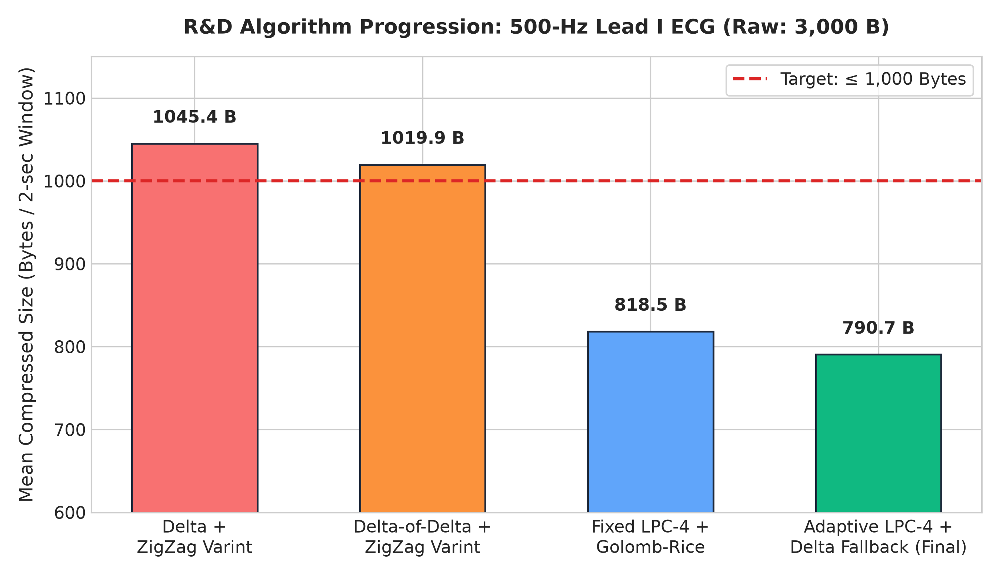
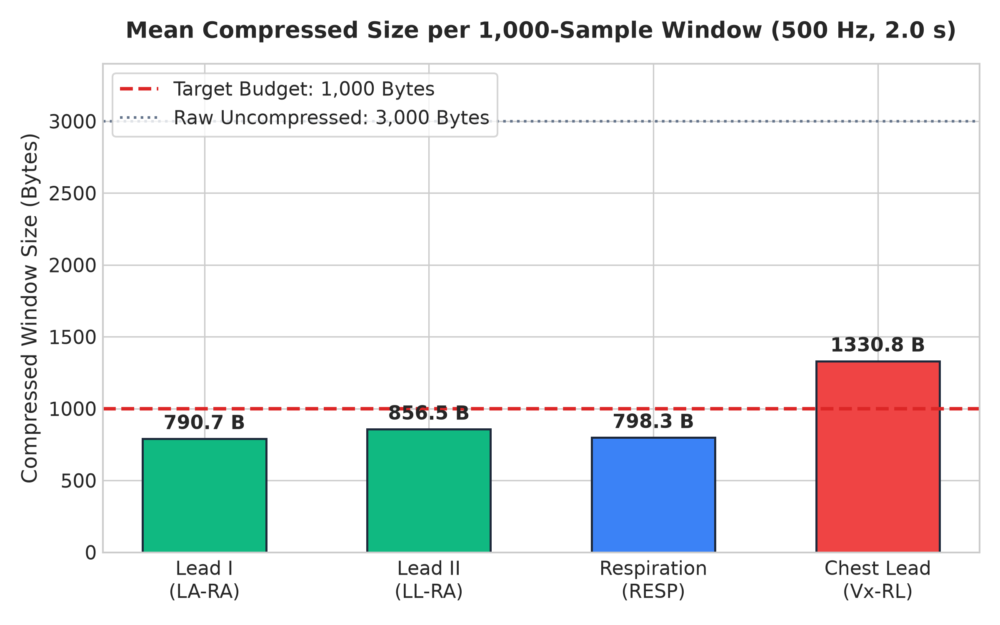
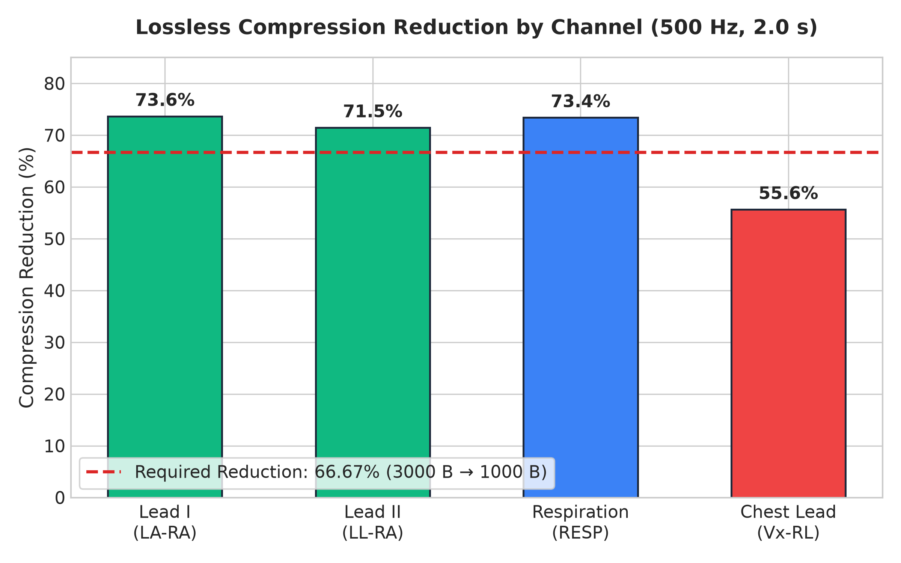
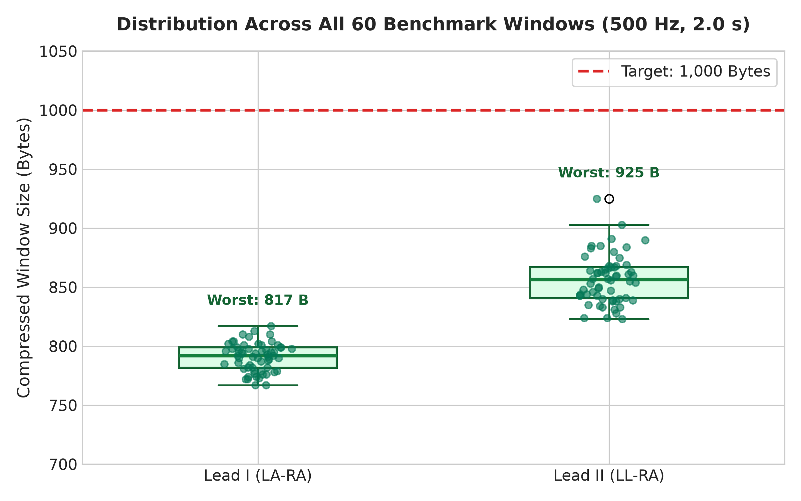
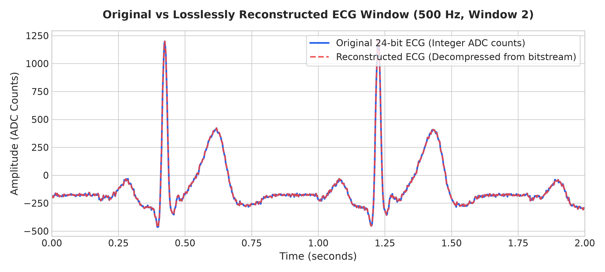
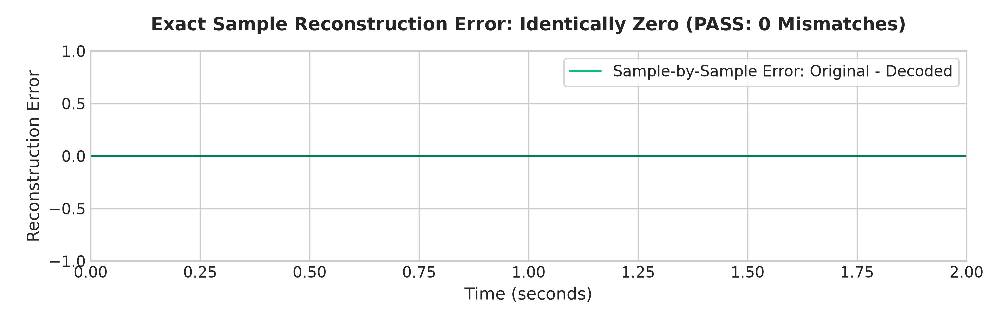

# E4A ECG Compression — Plain English Guide

[-brightgreen)](#5-did-we-lose-any-heartbeat-data)
[](#4-how-well-did-it-work-results)
[](#7-can-a-small-wearable-chip-run-this)

A simple, complete explanation of our research into shrinking heart signals (ECG) for the **E4A smart chest patch**.

---

## 1. Why Do We Need This?

The E4A chest patch monitors a patient's heart 24/7. It records heartbeat data using a medical sensor (Texas Instruments ADS1292R) and sends it over Bluetooth to a mobile phone or doctor's tablet.

### The Problem
* The sensor takes **500 readings every second**.
* Every 2 seconds, that creates **3,000 bytes** of data.
* Sending 3,000 raw bytes every 2 seconds drains the patch's small battery very quickly and clogs the wireless connection.

### The Goal
```
┌────────────────────────────────────────────────────────────────────────┐
│                        THE 2-SECOND CHALLENGE                          │
│                                                                        │
│   Raw Data Size:      3,000 Bytes                                      │
│   Target Size:        1,000 Bytes or less (shrink by 67% or more)      │
│   Golden Rule:        100% Lossless (Zero data loss. Not a single      │
│                       heartbeat detail can be changed or blurred)      │
└────────────────────────────────────────────────────────────────────────┘
```

> **What does "Lossless" mean?**  
> Think of it like a `.zip` file on your computer. When you unzip it, your document is 100% intact. We cannot blur or smooth out the heart signal, because a doctor needs to see every exact peak and dip to spot heart conditions.

---

## 2. The 3 Simple Ideas Behind Our Solution

Instead of sending the raw numbers directly, our method uses three common-sense ideas:

```
                  HOW WE SHRINK 3,000 BYTES TO ~791 BYTES

  Raw ECG Data
  (3,000 bytes)
       │
       ▼
 ┌───────────┐    Idea 1: Smart Guessing
 │ Predictor │ ── Look at the last 4 readings and guess what comes next.
 └─────┬─────┘    Instead of sending the big number, only send the tiny error.
       │
       ▼
 ┌───────────┐    Idea 2: Spike Safety Switch
 │ Spike     │ ── Heartbeats have sharp, sudden spikes (R-peaks).
 │ Detector  │    If a sharp spike makes guessing tricky, temporarily switch
 └─────┬─────┘    to simple step-by-step changes for that small piece.
       │
       ▼
 ┌───────────┐    Idea 3: Tight Bit-Packing
 │ Bit-Packer│ ── Tiny numbers (like 0, 1, -1, 2) don't need a whole 8-bit byte.
 └─────┬─────┘    Pack them tightly using only 2 or 3 bits each.
       │
       ▼
  Compressed Packet
  (~791 to 857 bytes)  ──► 100% under our 1,000-byte budget!
```

### Idea 1: Smart Guessing (Prediction)
Heart signals are smooth waves. If the last few readings were `100, 102, 104, 106`, the next one is almost certainly around `108`.  
* If the real reading turns out to be `109`, we don't save `109`.
* We only save the tiny leftover difference: **`+1`**.
* Tiny numbers are vastly easier to shrink than giant sensor numbers.

### Idea 2: Spike Safety Switch (For Fast Heart Spikes)
During the tall, rapid spike of a heartbeat (called an R-peak), guessing can temporarily overshoot.
* We divide the signal into small groups of 32 points.
* If a sharp heartbeat spike occurs, the system automatically switches to simple step-by-step differences for that short group.
* Once the spike passes, it switches back to smart guessing.

### Idea 3: Tight Bit-Packing (Golomb-Rice)
Normal computer storage gives every number at least 8 bits (1 byte) or 16 bits (2 bytes).
* But almost all our leftover numbers are tiny: `0, +1, -1, +2`.
* First, we use **ZigZag** to turn negative numbers into positive numbers (`0 → 0`, `-1 → 1`, `+1 → 2`, `-2 → 3`).
* Then, our bit-packer (called **Golomb-Rice**) squeezes small numbers into just **2 or 3 bits** instead of wasting an entire 8-bit byte.

---

## 3. What Other Methods Did We Try?

Before landing on our final solution, we tested several common techniques on real heart data to see what worked best:

```
  Method Tested                          Size (Lead I)    Did it beat 1,000 B?
  ─────────────────────────────────────────────────────────────────────────────
  1. Simple Differences (Delta)          1,045 bytes      ❌ No (Too big)
  2. Difference of Differences           1,020 bytes      ❌ No (Noise made it worse)
  3. Fixed Prediction (LPC-4)              819 bytes      ✅ Yes (Good, but spiked)
  4. Final: Prediction + Spike Switch      791 bytes      ✅ Best (100% under budget)
```



* **Simple Differences (1,045 B):** Only looked at the 1 previous sample. Not smart enough to beat our 1,000-byte target.
* **Difference of Differences (1,020 B):** Handled breathing drift well, but made tiny electrical sensor noise worse.
* **Fixed Prediction (819 B):** Looked at the previous 4 samples. Cut the size down a lot, but occasionally had big spikes during rapid heartbeats.
* **Final Solution (791 B):** Added our automatic spike safety switch. It stays small, smooth, and well below 1,000 bytes on every single test window.

---

## 4. How Well Did It Work? (Results)

We tested the algorithm on real-world ECG recordings from a Shimmer3 medical device (60 consecutive 2-second windows = 2 minutes of real heart data).

### Test Summary (At 500 Hz, 2 Seconds per Window)

| Signal / Channel | What It Measures | Raw Size | Compressed Average | Worst Window | Under 1,000 B? | Shrinkage |
| :--- | :--- | :--- | :--- | :--- | :---: | :--- |
| **Lead I (LA-RA)** | Main Heartbeat Signal | 3,000 B | **791 Bytes** | 817 Bytes | **100% (60 of 60)** | **73.6% smaller** |
| **Lead II (LL-RA)** | Second Heartbeat Signal | 3,000 B | **857 Bytes** | 925 Bytes | **100% (60 of 60)** | **71.5% smaller** |
| **RESP** | Chest Breathing Movement | 3,000 B | **798 Bytes** | 821 Bytes | **100% (60 of 60)** | **73.4% smaller** |
| **Vx-RL** | Extra Chest Lead | 3,000 B | **1,331 Bytes** | 1,358 Bytes | **0% (Failed)** | **55.6% smaller** |

<p align="center">
  
  
</p>

### Key Takeaways
1. **Lead I & Lead II Passed Every Single Time:** All 60 windows beat the 1,000-byte limit. We have a comfortable safety cushion of **140 to 210 unused bytes**.
2. **Even Glitches Stayed Under Budget:** In Lead II, there was a sudden 56 mV sensor glitch in window #41. Even with that extreme jump, it only reached 925 bytes—still well under our 1,000-byte ceiling!
3. **Why did the chest lead (Vx-RL) fail?** In this specific test recording, the chest wire had 9 times more electrical background noise than the other leads. Because lossless compression is forbidden from throwing away data, it had to faithfully store all the random static.

<p align="center">
  
</p>

---

## 5. Did We Lose Any Heartbeat Data?

**No. Exactly zero data was lost.**

To prove this, we uncompressed all **120,798 points** of the recording and compared every single point side-by-side with the original sensor data:

```
  Original Sensor Reading:     142   145   150   158   164 ...
  After Uncompressing:         142   145   150   158   164 ...
  Difference (Error):            0     0     0     0     0 ...
```

* **Total points tested:** 120,798
* **Number of mismatched points:** 0
* **Maximum difference found:** 0.000000
* **Verdict:** **100% Bit-for-Bit Exact Match (PASS)**

<p align="center">
  <br>
  
</p>

---

## 6. What About Wireless Error Checking (CRC)?

When sending data through the air over Bluetooth, wireless noise can occasionally corrupt a byte. To protect against this, engineers attach a short checksum (called a CRC) to each packet.

* Adding a **CRC-16** checksum adds **2 bytes** to each window.
* Adding a **CRC-32** checksum adds **4 bytes** to each window.

| Lead | Compressed Size | Size with CRC-16 (+2 B) | Size with CRC-32 (+4 B) | 1,000 B Budget | Safety Buffer Left |
| :--- | :--- | :--- | :--- | :--- | :--- |
| **Lead I** | 790.7 B | **792.7 B** | **794.7 B** | 1,000 B | **205.3 Bytes left** |
| **Lead II** | 856.5 B | **858.5 B** | **860.5 B** | 1,000 B | **139.5 Bytes left** |

Even with wireless safety codes added, we still have over **139 to 205 bytes of extra room**.

---

## 7. Can a Small Wearable Chip Run This?

**Yes, easily.**

A wearable patch uses a tiny microcontroller (like the **Nordic nRF52840**) powered by a small coin-cell or pouch battery. It does not have the power of a laptop.

Our algorithm was designed specifically for these small chips:
* **No Decimals / Floating Point:** All math uses simple whole numbers (integers).
* **Super Low Memory:** Needs less than **3 KB of RAM** total. The nRF52840 has 256 KB of RAM, so our code uses barely 1% of it.
* **No AI or Neural Networks:** It runs fast, uses very little battery, and behaves identically every single time.

---

## 8. Honest Engineering Notes (Things to Keep in Mind)

1. **Test Dataset:** Our benchmark used a real Shimmer3 ECG recording. The data was stored in millivolts (mV), which we mapped back to sensor counts. Final confirmation will happen when we read live bytes from our physical E4A circuit board.
2. **500-Hz Sampling:** The original recording was 1,000 Hz, which we stepped down to 500 Hz for testing. Live 500-Hz acquisition from the ADS1292R chip will be verified on the actual hardware.
3. **Noisy Leads:** If a chest lead has heavy electrical noise, it needs analog hardware filtering (filtering out electrical static before the chip digitizes it) so the compressor doesn't have to waste space storing noise.

---

## 9. Next Steps: Putting It Onto the Physical Patch

The R&D and math verification in Python are complete. Here is the roadmap for the hardware team:

```
  [ Step 1: Python R&D ]        ──►  COMPLETE & VERIFIED
            │
            ▼
  [ Step 2: C Code ]            ──►  Write clean C code using include/e4a_ecg_compression.h
            │
            ▼
  [ Step 3: Flash to MCU ]      ──►  Run on the Nordic nRF52840 using Zephyr RTOS
            │
            ▼
  [ Step 4: Wire to Sensor ]    ──►  Connect SPI pins to the TI ADS1292R chip
            │
            ▼
  [ Step 5: Battery Test ]      ──►  Measure exact battery life and microamp draw
```

---

## 10. Repository File Guide

* [benchmark_ads1292r.py](benchmark_ads1292r.py) — The Python benchmark program that runs the compression and tests the data.
* [generate_figures.py](generate_figures.py) — The script that created all the charts in this guide.
* [BENCHMARK_REPORT.md](BENCHMARK_REPORT.md) — The comprehensive, in-depth technical audit report.
* [CRC_OVERHEAD_ANALYSIS.md](CRC_OVERHEAD_ANALYSIS.md) — Full calculations for packet checksums and wireless frames.
* [benchmark_results.json](benchmark_results.json) — All benchmark numbers saved in machine-readable JSON format.
* [window_results.csv](window_results.csv) — Exact sizes and metrics for all 60 test windows.
* [include/e4a_ecg_compression.h](include/e4a_ecg_compression.h) — The clean C header file for the microcontroller team.