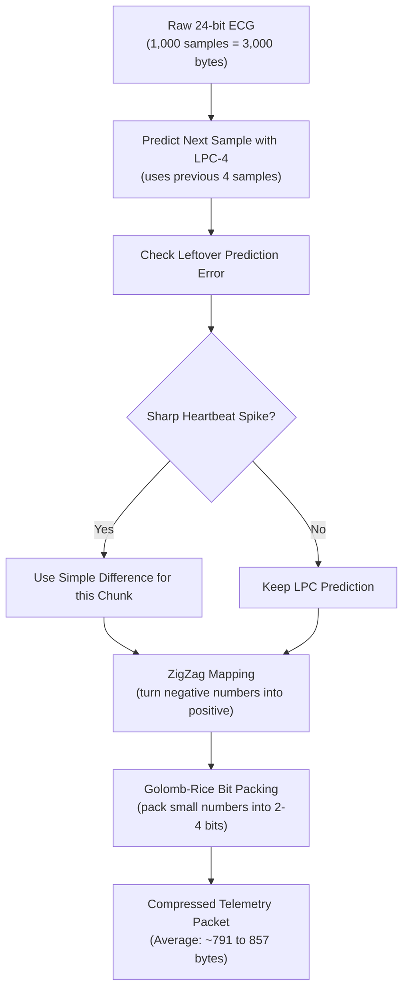

# E4A ECG Lossless Compression — R&D Guide

[](#6-did-we-lose-any-data-exact-lossless-check)
[-blue)](#5-how-well-does-it-work-benchmark-results)
[](#8-next-steps-bringing-it-to-hardware)

This document explains our research and testing to losslessly shrink ECG data for the **E4A wearable health monitor**.

---

## 1. The Problem We Solved

The E4A chest patch reads heart signals using a 24-bit Texas Instruments **ADS1292R** sensor. 

Sending continuous, raw heart data over Bluetooth / wireless drains the battery quickly and clogs the network. We needed to shrink the data stream before sending it.

```
+------------------------------------------------------------------------------------+
|  THE RAW DATA STREAM (500 Hz, 24-bit):                                              |
|  • Each second:  500 samples × 3 bytes = 1,500 bytes                              |
|  • Every 2 sec:  1,000 samples × 3 bytes = 3,000 raw bytes per ECG lead            |
|                                                                                    |
|  OUR TARGET:                                                                       |
|  • Goal:         1,000 bytes or less per 2-second window (at least 66.7% smaller)  |
|  • Rule:         100% lossless. Not a single heartbeat sample can be distorted     |
+------------------------------------------------------------------------------------+
```

---

## 2. What We Tried (Our R&D Journey)

We tested four approaches on real ECG data, moving from simple ideas to our final solution:

```
Result on 2-second window of Lead I ECG (Raw size: 3,000 bytes):
  1. Delta Encoding:                    1,045 bytes  ❌ (Missed the 1,000 B goal)
  2. Delta-of-Delta:                    1,020 bytes  ❌ (Still too large)
  3. Fixed LPC-4 + Bit-Packing:           819 bytes  ✅ (Passed, but spiked on R-peaks)
  4. Adaptive LPC-4 + Heartbeat Backup:   791 bytes  ✅ (Best: 100% under 1,000 B)
```


### Step 1: Delta Encoding (Differences)
* **The Idea:** Heartbeats change gradually. Instead of storing full numbers like `1000, 1002, 1005, 1007`, just store the differences: `1000, +2, +3, +2`.
* **What We Learned:** The differences are smaller numbers, but standard variable-byte storage still wasted too much space. It averaged **1,045 bytes**, missing our 1,000-byte goal.

### Step 2: Delta-of-Delta (Difference of Differences)
* **The Idea:** Instead of storing the difference, store how much the difference changed from the last step.
* **What We Learned:** It smoothed out slow breathing movements, but made small sensor noise worse. It averaged **1,020 bytes**, which was still over budget.

### Step 3: LPC-4 (Smart Mathematical Prediction)
* **The Idea:** Instead of just looking at the single previous sample, use the **last 4 samples** to predict what the next sample should be.
* **How It Works:**
  ```
  Last 4 Samples ──► [ x(n-1), x(n-2), x(n-3), x(n-4) ]
                              │
                              ▼
                     ┌──────────────────┐
                     │  LPC-4 Predictor │
                     └──────────────────┘
                              │
                              ▼
                       Predicted Point
                              │
            Actual Point ──► (Actual - Predicted)
                              │
                              ▼
                        Tiny Leftover Error
  ```
* **What We Learned:** The predictions were remarkably accurate. Most leftover errors were very close to 0.

### Step 4: Better Packing (ZigZag + Golomb-Rice)
* **The Idea:** Prediction errors are positive or negative numbers around zero (`-1, +2, 0, -2`).
  1. **ZigZag:** Re-maps them to small positive numbers: `0 -> 0`, `-1 -> 1`, `+1 -> 2`, `-2 -> 3`.
  2. **Golomb-Rice:** Instead of spending an entire 8-bit byte on small numbers like `1` or `2`, pack them into just 2 or 3 bits.
* **What We Learned:** This cut our window size down to **819 bytes**—comfortably below the 1,000-byte target!

### Step 5: Heartbeat Spike Backup (Transient Delta Mode)
* **The Idea:** During the sharp, tall peak of a heartbeat (the R-peak), the mathematical LPC formula can overreact and overshoot.
* **The Fix:** We divide the data into short chunks of 32 samples. If a sharp spike is detected where simple differences work better than LPC, the compressor automatically switches to simple differences for that short chunk.
* **What We Learned:** This eliminated overshoot spikes and saved an extra **30 bytes per window**, bringing Lead I down to **791 bytes**.

---

## 3. The Final Compression Pipeline

Our final technique is: **Adaptive LPC-4 + Delta Fallback + ZigZag + Golomb-Rice**.



1. **Window Size:** Takes 1,000 samples at a time (exactly 2.0 seconds at 500 Hz).
2. **Predictor:** Runs LPC-4 using simple integer math (no floating point decimals).
3. **Spike Protection:** Uses simple differences during rapid R-peak heart spikes.
4. **Bit-Packer:** Squeezes numbers into fractional bits using Golomb-Rice.

---

## 4. Why We Picked This Approach

* **Huge Safety Margin:** Leaves a safety buffer of **140 to 210 bytes** below our 1,000-byte ceiling.
* **Zero Math Guesswork:** It is 100% deterministic and completely lossless.
* **Made for Small Chips:** Uses standard addition, multiplication, and bit-shifts (`>> 8`). No division or decimals needed during decompression.
* **Tiny Memory Footprint:** Needs less than **3 KB of RAM** total. Fits easily on small microcontrollers like the Nordic nRF52840.
* **No AI / Neural Network Overhead:** Pure algorithmic code with guaranteed speed and battery savings.

---

## 5. How Well Does It Work? (Benchmark Results)

> [!NOTE]
> **Important Note on the Test Dataset:**  
> We ran our tests on a real-world Shimmer3 ECG recording ([SampleECG_Session1_Shimmer_B64E_Calibrated_SD.csv](Shimmer3_ECG_Sample_Data/SampleECG_Session1_Shimmer_B64E_Calibrated_SD.csv)). The recording stores data in millivolts (mV) rather than raw register bytes. We converted the millivolts back to the sensor's whole integer counts for testing. These results prove the compression algorithm works on real ECG signals, but final confirmation on the physical E4A circuit board is still to come.

### 500-Hz Simulation (2-Second Windows = 1,000 Samples)
This evaluates the exact planned E4A setup: 1,000 samples at 500 Hz (2.0 seconds per window). The uncompressed size is 3,000 bytes per window.

| Channel | What It Measures | Average Size | Worst Window | Target Hit Rate (≤ 1,000 B) | Reduction | Result |
| :--- | :--- | :--- | :--- | :--- | :--- | :--- |
| **Lead I (LA-RA)** | Main Heartbeat Lead | **791 Bytes** | 817 Bytes | **100% (60 of 60 windows)** | **73.6%** | **PASS** |
| **Lead II (LL-RA)** | Secondary Heartbeat Lead | **857 Bytes** | 925 Bytes | **100% (60 of 60 windows)** | **71.5%** | **PASS** |
| **RESP** | Chest Breathing Movement | **798 Bytes** | 821 Bytes | **100% (60 of 60 windows)** | **73.4%** | **PASS** |
| **Vx-RL** | Extra Chest Lead | **1,331 Bytes** | 1,358 Bytes | **0% (0 of 60 windows)** | **55.6%** | **FAILS BUDGET** |

<p align="center">
  
  
</p>

### Window Distribution (Lead I & Lead II)
Every single window for Lead I and Lead II passed the 1,000-byte target. Even the single worst window in Lead II (which had a huge 56 mV sensor glitch) stayed under budget at 925 bytes.

<p align="center">
  
</p>

### Why Did the Chest Lead (Vx-RL) Fail?
In this dataset, the chest lead (Vx-RL) had **9 times more sample-to-sample noise** than Lead I. Because lossless compression cannot throw away random noise, it required ~1,331 bytes. For future multi-lead designs using chest leads, analog hardware filtering will be needed first.

---

## 6. Did We Lose Any Data? (Exact Lossless Check)

"Lossless" means that when you decompress the file, every single sample is **100% identical** to what came out of the sensor.

```
Original Sensor Numbers:     [ 120,  125,  134,  140, ... ]
                                          │
                                          ▼
                                   [ Compression ]
                                          │
                                          ▼
                                  Compressed Packet
                                          │
                                          ▼
                                  [ Decompression ]
                                          │
                                          ▼
Reconstructed Numbers:       [ 120,  125,  134,  140, ... ]
                                          │
                                          ▼
Comparison:                  Identical! (0 errors, 0 mismatches)
```

We verified all **120,798 samples** in the dataset:
* **Total mismatches:** 0
* **Maximum error:** 0.0000
* **Result:** **100% BIT-FOR-BIT LOSSLESS PASS**

<p align="center">
  <br>
  
</p>

---

## 7. Adding Error Checking (CRC Checksum)

In real wireless transmission, packets need a short checksum (CRC) at the end to catch radio static. CRC is part of wireless packet wrapping, not compression itself.

* Adding a **CRC-16** adds **2 bytes** to each window (+0.07%).
* Adding a **CRC-32** adds **4 bytes** to each window (+0.13%).

| Lead | Base Compressed Size | With CRC-16 (+2 B) | With CRC-32 (+4 B) | Target Budget | Headroom Remaining |
| :--- | :--- | :--- | :--- | :--- | :--- |
| **Lead I** | 790.7 B | **792.7 B** | **794.7 B** | 1,000 B | **205.3 Bytes** |
| **Lead II** | 856.5 B | **858.5 B** | **860.5 B** | 1,000 B | **139.5 Bytes** |

Adding CRC keeps us comfortably under budget with over 139 bytes of headroom to spare. (See [CRC_OVERHEAD_ANALYSIS.md](CRC_OVERHEAD_ANALYSIS.md) for details).

---

## 8. Next Steps: Bringing It to Hardware

The Python code in [benchmark_ads1292r.py](benchmark_ads1292r.py) is our reference algorithm. The next step is embedding it into the physical E4A patch:

```
[ Python Algorithm ]  ──►  (R&D Complete & Verified)
         │
         ▼
[ Write in Clean C ]  ──►  Uses include/e4a_ecg_compression.h
         │
         ▼
[ Zephyr RTOS Driver ] ──► Runs on Nordic nRF52840 microcontroller
         │
         ▼
[ Physical Sensor ]   ──► Read live samples from ADS1292R chip over SPI
         │
         ▼
[ Battery & Speed ]   ──► Measure actual CPU cycle time and microamps
```

---

## 9. Current Limitations (Honest Engineering Notes)

1. **Calibrated Dataset:** The dataset came as calibrated millivolt values, not raw binary sensor dumps.
2. **500-Hz Resampling:** The 500-Hz stream was downsampled from 1000-Hz data for simulation. Direct 500-Hz hardware capture still needs validation.
3. **Chest Lead:** The chest lead (Vx-RL) failed the 1,000-byte budget due to high baseline noise.
4. **Hardware Measurements:** Actual battery draw, CPU cycles, and wireless transmission times must still be measured on the physical circuit board.

---

## 10. R&D Conclusion

After testing multiple approaches, we selected **adaptive LPC-4 prediction with Delta fallback, ZigZag mapping, and Golomb-Rice packing**.

On real ECG test data at 500 Hz, this algorithm compressed **Lead I to ~791 bytes** and **Lead II to ~857 bytes** per 2-second window (a **71% to 74% reduction**), easily beating our 1,000-byte ceiling while reconstructing every single sample with **zero error**. 

These results prove the concept works. We are now ready to freeze this algorithm design and build the C implementation for the physical E4A telemetry device.

---

## Repository Files
* [benchmark_ads1292r.py](benchmark_ads1292r.py) — The Python benchmark and audit script
* [BENCHMARK_REPORT.md](BENCHMARK_REPORT.md) — Full technical audit report
* [CRC_OVERHEAD_ANALYSIS.md](CRC_OVERHEAD_ANALYSIS.md) — Checksum and frame integrity calculations
* [benchmark_results.json](benchmark_results.json) — Complete machine-readable results
* [window_results.csv](window_results.csv) — Window-by-window benchmark metrics
* [include/e4a_ecg_compression.h](include/e4a_ecg_compression.h) — Target C header file for embedded implementation